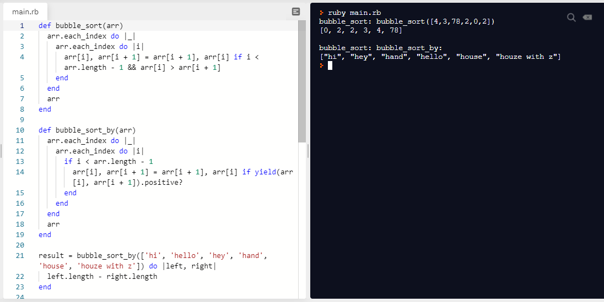

# Bubble Sort

> This project was developed as a learning project part of the Microverse curriculum.



Part of the learning ruby curriculum, we were tasked to create two array sorting functions. The functions are the
implementation of the bubble sort algorithm. The **bubble_sort** function accepts an array of integers and sorts them
in an ascending order of magnitude. The second function, the **bubble_sort_by** requires that we make use of ruby's block
and yield feature to pass in a predicate to the sort function.


## Live Demo
[Quick live demo](https://repl.it/repls/RunnyCompetitivePortablesoftware#main.rb)

## Built With
- Ruby

## Getting Started

To get a local copy up and running follow these simple example steps.

### Prerequisites

Ruby runtime

### Install

1) [Download](Clone the repository to your machine)

```sh
$ git clone https://github.com/belsman/Building-with-Responsive-Design/tree/develop
```

2) Navigate to the project folder and execute "ruby bubble_sort.rb".

### Usage

Try sorting your collections of numbers.

## Authors

👤 **Bello Babakolo**

- Github: [@belsman](https://github.com/belsman)
- Linkdin: [Bello Babakolo](https://www.linkedin.com/in/bello-babakolo-b23b17145/)
- Twitter: [@d_belsman](https://twitter.com/d_belsman)


👤 **Rick Oburu**

- Github: [@RICKCOYL](https://github.com/RICKCOYL)
- Linkdin: [Rick Oburu](https://www.linkedin.com/in/rick-oburu-8627591a4/)
- Twitter: [@Rickcoyl]https://twitter.com/Rickcoyl


## 🤝 Contributing

Contributions, issues and feature requests are welcome!

Feel free to check the [issues page](issues/).

## Show your support

Give a ⭐️ if you like this project!

## Acknowledgments

- Microverse for showing the way for this project to happen
